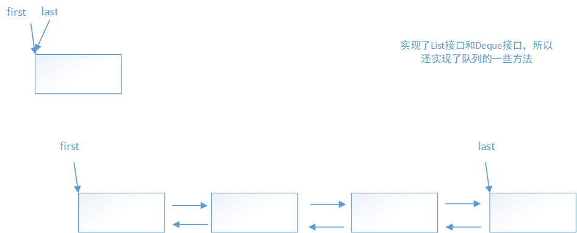
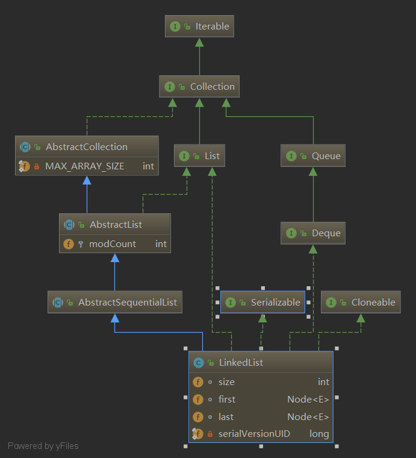

## JDK版本

```
JDK 1.8.0_144
```

## 概述

 *LinkedList*同时实现了*List*接口和*Deque*接口，也就是说它既可以看作一个顺序容器，又可以看作一个队列(*Queue*)，同时又可以看作一个栈(*Stack*)。 

*LinkedList*的实现方式决定了所有跟下标相关的操作都是线性时间，而在首段或者末尾删除元素只需要常数时间。为追求效率*LinkedList*没有实现同步(synchronized)，如果需要多个线程并发访问，可以先采用`Collections.synchronizedList()`方法对其进行包装。



### 实现

#### 类关系



#### 底层数据结构

LinkedList内部通过双向链表实现，每个节点由内部类Node表示。LinkedList通过first和last指向第一个和最后一个元素。

```java
 	transient int size = 0;

    /**
     * Pointer to first node.
     * Invariant: (first == null && last == null) ||
     *            (first.prev == null && first.item != null)
     */
    transient Node<E> first;

    /**
     * Pointer to last node.
     * Invariant: (first == null && last == null) ||
     *            (last.next == null && last.item != null)
     */
    transient Node<E> last;

	private static class Node<E> {
        E item;
        Node<E> next;
        Node<E> prev;

        Node(Node<E> prev, E element, Node<E> next) {
            this.item = element;
            this.next = next;
            this.prev = prev;
        }
    }
```

