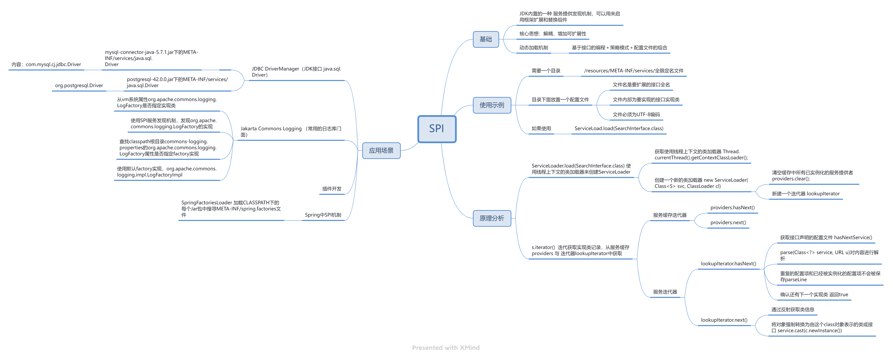

# SPI机制

SPI（Service Provider Interface），是JDK内置的一种 服务提供发现机制，可以用来启用框架扩展和替换组件，主要是被框架的开发人员

使用，比如java.sql.Driver接口，其他不同厂商可以针对同一接口做出不同的实现，MySQL和PostgreSQL都有不同的实现提供给用户，

而Java的SPI机制可以为某个接口寻找服务实现。

Java SPI 实际上是 **“基于接口的编程＋策略模式＋配置文件”** 组合实现的动态加载机制。在模块化设计中这个机制尤其重要，其核心思想就

是 **解耦**，增加可扩展性。

当服务的提供者提供了一种接口的实现之后，需要在classpath下的`META-INF/services/`目录里创建一个以服务接口命名的文件，这个

文件里的内容就是这个接口的具体的实现类。当其他的程序需要这个服务的时候，就可以通过查找这个jar包（一般都是以jar包做依赖）

的`META-INF/services/`中的配置文件，配置文件中有接口的具体实现类名，可以根据这个类名进行加载实例化，就可以使用该服务了。

JDK中查找服务的实现的工具类是：`java.util.ServiceLoader`。

### 思维导图



### 实现原理

```java
//ServiceLoader实现了Iterable接口，可以遍历所有的服务实现者
public final class ServiceLoader<S>
    implements Iterable<S>
{

    //查找配置文件的目录
    private static final String PREFIX = "META-INF/services/";

    //表示要被加载的服务的类或接口
    private final Class<S> service;

    //这个ClassLoader用来定位，加载，实例化服务提供者
    private final ClassLoader loader;

    // 访问控制上下文
    private final AccessControlContext acc;

    // 缓存已经被实例化的服务提供者，按照实例化的顺序存储
    private LinkedHashMap<String,S> providers = new LinkedHashMap<>();

    // 迭代器
    private LazyIterator lookupIterator;


    //重新加载，就相当于重新创建ServiceLoader了，用于新的服务提供者安装到正在运行的Java虚拟机中的情况。
    public void reload() {
        //清空缓存中所有已实例化的服务提供者
        providers.clear();
        //新建一个迭代器，该迭代器会从头查找和实例化服务提供者
        lookupIterator = new LazyIterator(service, loader);
    }

    //私有构造器
    //使用指定的类加载器和服务创建服务加载器
    //如果没有指定类加载器，使用系统类加载器，就是应用类加载器。
    private ServiceLoader(Class<S> svc, ClassLoader cl) {
        service = Objects.requireNonNull(svc, "Service interface cannot be null");
        loader = (cl == null) ? ClassLoader.getSystemClassLoader() : cl;
        acc = (System.getSecurityManager() != null) ? AccessController.getContext() : null;
        reload();
    }

    //解析失败处理的方法
    private static void fail(Class<?> service, String msg, Throwable cause)
        throws ServiceConfigurationError
    {
        throw new ServiceConfigurationError(service.getName() + ": " + msg,
                                            cause);
    }

    private static void fail(Class<?> service, String msg)
        throws ServiceConfigurationError
    {
        throw new ServiceConfigurationError(service.getName() + ": " + msg);
    }

    private static void fail(Class<?> service, URL u, int line, String msg)
        throws ServiceConfigurationError
    {
        fail(service, u + ":" + line + ": " + msg);
    }

    //解析服务提供者配置文件中的一行
    //首先去掉注释校验，然后保存
    //返回下一行行号
    //重复的配置项和已经被实例化的配置项不会被保存
    private int parseLine(Class<?> service, URL u, BufferedReader r, int lc,
                          List<String> names)
        throws IOException, ServiceConfigurationError
    {
        //读取一行
        String ln = r.readLine();
        if (ln == null) {
            return -1;
        }
        //#号代表注释行
        int ci = ln.indexOf('#');
        if (ci >= 0) ln = ln.substring(0, ci);
        ln = ln.trim();
        int n = ln.length();
        if (n != 0) {
            if ((ln.indexOf(' ') >= 0) || (ln.indexOf('\t') >= 0))
                fail(service, u, lc, "Illegal configuration-file syntax");
            int cp = ln.codePointAt(0);
            if (!Character.isJavaIdentifierStart(cp))
                fail(service, u, lc, "Illegal provider-class name: " + ln);
            for (int i = Character.charCount(cp); i < n; i += Character.charCount(cp)) {
                cp = ln.codePointAt(i);
                if (!Character.isJavaIdentifierPart(cp) && (cp != '.'))
                    fail(service, u, lc, "Illegal provider-class name: " + ln);
            }
            if (!providers.containsKey(ln) && !names.contains(ln))
                names.add(ln);
        }
        return lc + 1;
    }

    //解析配置文件，解析指定的url配置文件
    //使用parseLine方法进行解析，未被实例化的服务提供者会被保存到缓存中去
    private Iterator<String> parse(Class<?> service, URL u)
        throws ServiceConfigurationError
    {
        InputStream in = null;
        BufferedReader r = null;
        ArrayList<String> names = new ArrayList<>();
        try {
            in = u.openStream();
            r = new BufferedReader(new InputStreamReader(in, "utf-8"));
            int lc = 1;
            while ((lc = parseLine(service, u, r, lc, names)) >= 0);
        }
        return names.iterator();
    }

    //服务提供者查找的迭代器
    private class LazyIterator
        implements Iterator<S>
    {

        Class<S> service;//服务提供者接口
        ClassLoader loader;//类加载器
        Enumeration<URL> configs = null;//保存实现类的url
        Iterator<String> pending = null;//保存实现类的全名
        String nextName = null;//迭代器中下一个实现类的全名

        private LazyIterator(Class<S> service, ClassLoader loader) {
            this.service = service;
            this.loader = loader;
        }

        private boolean hasNextService() {
            if (nextName != null) {
                return true;
            }
            if (configs == null) {
                try {
                    String fullName = PREFIX + service.getName();
                    if (loader == null)
                        configs = ClassLoader.getSystemResources(fullName);
                    else
                        configs = loader.getResources(fullName);
                }
            }
            while ((pending == null) || !pending.hasNext()) {
                if (!configs.hasMoreElements()) {
                    return false;
                }
                pending = parse(service, configs.nextElement());
            }
            nextName = pending.next();
            return true;
        }

        private S nextService() {
            if (!hasNextService())
                throw new NoSuchElementException();
            String cn = nextName;
            nextName = null;
            Class<?> c = null;
            try {
                c = Class.forName(cn, false, loader);
            }
            if (!service.isAssignableFrom(c)) {
                fail(service, "Provider " + cn  + " not a subtype");
            }
            try {
                S p = service.cast(c.newInstance());
                providers.put(cn, p);
                return p;
            }
        }

        public boolean hasNext() {
            if (acc == null) {
                return hasNextService();
            } else {
                PrivilegedAction<Boolean> action = new PrivilegedAction<Boolean>() {
                    public Boolean run() { return hasNextService(); }
                };
                return AccessController.doPrivileged(action, acc);
            }
        }

        public S next() {
            if (acc == null) {
                return nextService();
            } else {
                PrivilegedAction<S> action = new PrivilegedAction<S>() {
                    public S run() { return nextService(); }
                };
                return AccessController.doPrivileged(action, acc);
            }
        }

        public void remove() {
            throw new UnsupportedOperationException();
        }

    }

    //获取迭代器
    //返回遍历服务提供者的迭代器
    //以懒加载的方式加载可用的服务提供者
    //懒加载的实现是：解析配置文件和实例化服务提供者的工作由迭代器本身完成
    public Iterator<S> iterator() {
        return new Iterator<S>() {
            //按照实例化顺序返回已经缓存的服务提供者实例
            Iterator<Map.Entry<String,S>> knownProviders
                = providers.entrySet().iterator();

            public boolean hasNext() {
                if (knownProviders.hasNext())
                    return true;
                return lookupIterator.hasNext();
            }

            public S next() {
                if (knownProviders.hasNext())
                    return knownProviders.next().getValue();
                return lookupIterator.next();
            }

            public void remove() {
                throw new UnsupportedOperationException();
            }

        };
    }

    //为指定的服务使用指定的类加载器来创建一个ServiceLoader
    public static <S> ServiceLoader<S> load(Class<S> service,
                                            ClassLoader loader)
    {
        return new ServiceLoader<>(service, loader);
    }

    //使用线程上下文的类加载器来创建ServiceLoader
    public static <S> ServiceLoader<S> load(Class<S> service) {
        ClassLoader cl = Thread.currentThread().getContextClassLoader();
        return ServiceLoader.load(service, cl);
    }

    //使用扩展类加载器为指定的服务创建ServiceLoader
    //只能找到并加载已经安装到当前Java虚拟机中的服务提供者，应用程序类路径中的服务提供者将被忽略
    public static <S> ServiceLoader<S> loadInstalled(Class<S> service) {
        ClassLoader cl = ClassLoader.getSystemClassLoader();
        ClassLoader prev = null;
        while (cl != null) {
            prev = cl;
            cl = cl.getParent();
        }
        return ServiceLoader.load(service, prev);
    }

    public String toString() {
        return "java.util.ServiceLoader[" + service.getName() + "]";
    }

}

```

### 缺陷

通过上面的解析，可以发现，我们使用SPI机制的缺陷：

- 不能按需加载，需要遍历所有的实现，并实例化，然后在循环中才能找到我们需要的实现。如果不想用某些实现类，或者某些类实例化很耗时，它也被载入并实例化了，这就造成了浪费。
- 获取某个实现类的方式不够灵活，只能通过 Iterator 形式获取，不能根据某个参数来获取对应的实现类。
- 多个并发多线程使用 ServiceLoader 类的实例是不安全的

