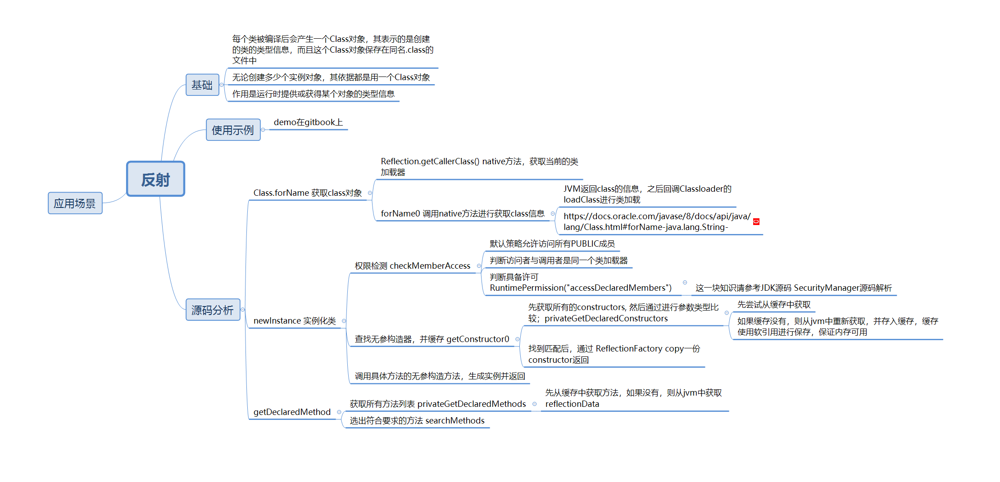

# 反射机制

## 基础

### 定义

JAVA反射机制是在运行状态中，对于任意一个类，都能够知道这个类的所有属性和方法；对于任意一个对象，都能够调用它的任意一个方法和属性；这种动态获取的信息以及动态调用对象的方法的功能称为java语言的反射机制。

### 核心

Class类是支持反射机制的核心类，存在于JDK的java.lang路径下。

其特点为：

- Class类也是类的一种，与class关键字是不一样的。
- 手动编写的类被编译后会产生一个Class对象，其表示的是创建的类的类型信息，而且这个Class对象保存在同名.class的文件中(字节码文件)
- 每个通过关键字class标识的类，在内存中有且只有一个与之对应的Class对象来描述其类型信息，无论创建多少个实例对象，其依据的都是用一个Class对象。
- Class类只存私有构造函数，因此对应Class对象只能有JVM创建和加载
- Class类的对象作用是运行时提供或获得某个对象的类型信息，这点对于反射技术很重要

## 使用示例

详细使用API含义，读者可以阅读一下JDK源码注释

```java
package Java;

import java.lang.reflect.Constructor;
import java.lang.reflect.Field;
import java.lang.reflect.InvocationTargetException;
import java.lang.reflect.Method;

public class Reflect {
    public static void main(String[] args) throws ClassNotFoundException, InstantiationException, IllegalAccessException, NoSuchMethodException, InvocationTargetException {
        System.out.println("--------Class 类对象的获取--------");

        System.out.printf("根据类名：%s 获取 Class 对象成功 \n", User.class);
        System.out.printf("根据对象：%s 获取 Class 对象成功 \n", new User().getClass());
        System.out.printf("根据全限定类名：%s 获取 Class 对象成功 \n", Class.forName("Java.User"));

        Class<User> userClass = User.class;
        System.out.printf("获取全限定类名：%s \n", userClass.getName());
        System.out.printf("获取类名：%s \n", userClass.getName());
        System.out.printf("实例化：%s \n", userClass.newInstance());

        System.out.printf("当前类是否为接口类：%s\n", userClass.isInterface());
        System.out.printf("当前类是否为注解类：%s\n", userClass.isAnnotation());
        System.out.printf("当前类的父类：%s\n", userClass.getSuperclass());

        System.out.println("打印当前类及父类的所有 PUBLIC 字段：");
        for (Field field : userClass.getFields()) {
            System.out.println(field.getName());
        }

        System.out.println("打印当前类的所有字段：");
        for (Field field : userClass.getDeclaredFields()) {
            System.out.println(field.getName());
        }

        System.out.println("--------Constructor 构造方法用法，详细API请了解 Constructor 源码--------");
        Class<?> claszz = Class.forName("Java.User");
        User aa = (User) claszz.newInstance(); // 反射调用无参构造方法初始化对象
        aa.setAge("22");
        aa.setName("aa");

        // 获取带 String 参数的 public类型 构造函数并进行初始化
        Constructor<?> cs2 = claszz.getConstructor(String.class, String.class);
        User cc = (User) cs2.newInstance("cc", "1");

        // 获取带 String 参数的 private 构造函数并进行初始化
        Constructor<?> cs3 = claszz.getDeclaredConstructor(String.class, String.class, String.class);
        // 由于是 private 必须设置可访问
        cs3.setAccessible(true);
        // 实例化user对象
        User bb = (User) cs3.newInstance("1", "cc", "22");

        System.out.println("--------Field 构造方法用法，详细API请了解 Field 源码--------");
        try {
            // 获取指定字段名称的Field类,注意字段修饰符必须为public而且存在该字段,
            // 否则抛NoSuchFieldException
            Field nameField = claszz.getField("name");
        } catch (NoSuchFieldException e) {
            e.printStackTrace();
        }
        // 获取所有修饰符为public的字段,包含父类字段,注意修饰符为public才会获取
        Field fields[] = claszz.getFields();
        for (Field f : fields) {
            System.out.println("f:" + f.getDeclaringClass());
        }

        System.out.println("================getDeclaredFields====================");
        // 获取当前类所字段(包含private字段),注意不包含父类的字段
        Field fields2[] = claszz.getDeclaredFields();
        for (Field f : fields2) {
            System.out.println("f2:" + f.getDeclaringClass());
        }
        // 获取指定字段名称的Field类,可以是任意修饰符的字段,注意不包含父类的字段
        Field field2 = null;
        try {
            field2 = claszz.getDeclaredField("age");
        } catch (NoSuchFieldException e) {
            e.printStackTrace();
        }
        System.out.println("field2:" + field2);

        System.out.println("--------Method 构造方法用法，详细API请了解 Method 源码--------");
        Method info = claszz.getMethod("info", String.class);

        // 获取所有public方法
        Method[] methods = claszz.getMethods();
        for (Method m : methods) {
            System.out.println(m);
        }

        Method method1 = claszz.getDeclaredMethod("info", String.class);
        System.out.println("method1::"+method1);
        // 获取当前类的所有方法包含private,该方法无法获取继承自父类的method
        Method[] methods1=claszz.getDeclaredMethods();
        for (Method m:methods1){
            System.out.println("m1::"+m);
        }
    }
}

class Human {
    public String sleep;

    public String getSleep() {
        return sleep;
    }

    public void setSleep(String sleep) {
        this.sleep = sleep;
    }
}

class User extends Human {
    private String sex;
    public String name;
    public String age;

    public User() {
    }

    public User(String name, String sex) {
        this.sex = sex;
        this.name = name;
    }

    private User(String sex, String name, String age) {
        this.sex = sex;
        this.name = name;
        this.age = age;
    }

    public void info(String name) {
        System.out.println("info .... name is " + name);
    }

    public String getName() {
        return name;
    }

    public void setName(String name) {
        this.name = name;
    }

    public String getAge() {
        return age;
    }

    public void setAge(String age) {
        this.age = age;
    }

    public String getSex() {
        return sex;
    }

    public void setSex(String sex) {
        this.sex = sex;
    }
}
```

> 关于Class类提供的其他API，读者可通过阅读源码了解。养成读源码的好习惯~

## 原理分析



反射调用流程小结

最后，用几句话总结反射的实现原理：

1. 反射类及反射方法的获取，都是通过从列表中搜寻查找匹配的方法，所以**查找性能**会随类的大小方法多少而变化；
2. 每个类都会有一个与之对应的Class实例，从而每个类都可以获取method反射方法，并作用到其他实例身上；
3. 反射也是考虑了线程安全的，放心使用；
4. 反射使用软引用relectionData缓存class信息，避免每次重新从jvm获取带来的开销；
5. 反射调用多次生成新代理Accessor, 而通过字节码生存的则考虑了卸载功能，所以会使用独立的类加载器；
6. 当找到需要的方法，都会copy一份出来，而不是使用原来的实例，从而保证数据隔离；
7. 调度反射方法，最终是由jvm执行invoke0()执行；

## 应用场景

- 逆向代码 ，例如反编译
- 与注解相结合的框架，例如 `Retrofit`
- 单纯的反射机制应用框架，例如 `EventBus`
- 动态生成类框架 例如Gson

