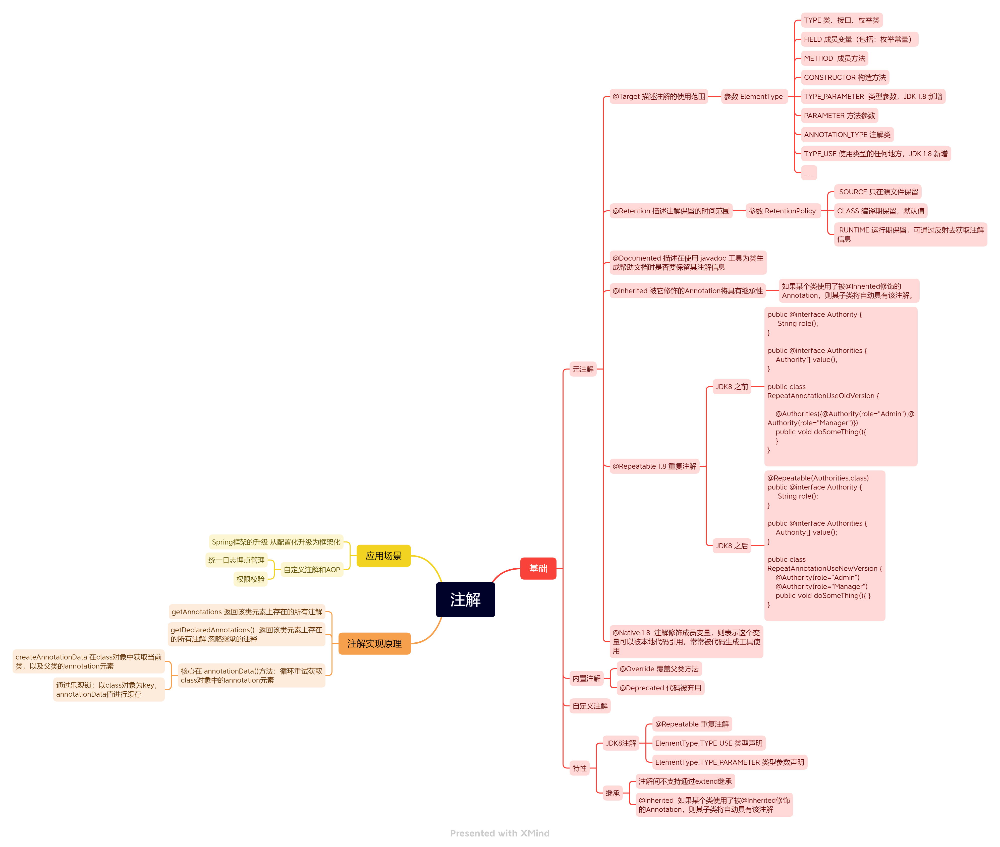

# 基础

## 元注解

### @Target 描述注解的使用范围

#### 参数 ElementType 

- TYPE 类、接口、枚举类
- FIELD 成员变量（包括：枚举常量）
- METHOD  成员方法
- CONSTRUCTOR 构造方法
- TYPE_PARAMETER  类型参数，JDK 1.8 新增
- PARAMETER 方法参数
- ANNOTATION_TYPE 注解类
- TYPE_USE 使用类型的任何地方，JDK 1.8 新增
- .....

### @Retention 描述注解保留的时间范围

参数 RetentionPolicy 

- SOURCE 只在源文件保留
- CLASS 编译期保留，默认值
- RUNTIME 运行期保留，可通过反射去获取注解信息

### @Documented 

描述在使用 javadoc 工具为类生成帮助文档时是否要保留其注解信息

### @Inherited 

被它修饰的Annotation将具有继承性

如果某个类使用了被@Inherited修饰的Annotation，则其子类将自动具有该注解。

### @Repeatable 1.8 重复注解

JDK8 之前

```java
public @interface Authority {
     String role();
}

public @interface Authorities {
    Authority[] value();
}

public class RepeatAnnotationUseOldVersion {

    @Authorities({@Authority(role="Admin"),@Authority(role="Manager")})
	public void doSomeThing(){}
}
```

JDK8 之后

```java
@Repeatable(Authorities.class)
public @interface Authority {
     String role();
}

public @interface Authorities {
    Authority[] value();
}

public class RepeatAnnotationUseNewVersion {
    @Authority(role="Admin")
    @Authority(role="Manager")
    public void doSomeThing(){ }
}
```
### @Native 

注解修饰成员变量，则表示这个变量可以被本地代码引用，常常被代码生成工具使用

#### 内置注解

@Override 覆盖父类方法
@Deprecated 代码被弃用

#### 自定义注解

#### 特性

- JDK8注解
- @Repeatable 重复注解
- ElementType.TYPE_USE 类型声明
- ElementType.TYPE_PARAMETER 类型参数声明

#### 继承

- 注解间不支持通过extend继承
  @Inherited  如果某个类使用了被@Inherited修饰的Annotation，则其子类将自动具有该注解

## 注解实现原理

getAnnotations 返回该类元素上存在的所有注解
getDeclaredAnnotations()  返回该类元素上存在的所有注解 忽略继承的注释

### 核心逻辑

每个类对应的class对象都存储着该类对应的注解信息

-  annotationData()方法：循环重试获取class对象中的annotation元素，具体操作为解析该类的字节码文件
- createAnnotationData 在class对象中获取当前类，以及父类的annotation元素
- 通过乐观锁：以class对象为key，annotationData值进行缓存

## 应用场景

- Spring框架的升级 从配置化升级为框架化

- 自定义注解和AOP

  - 统一日志埋点管理

  - 权限校验
