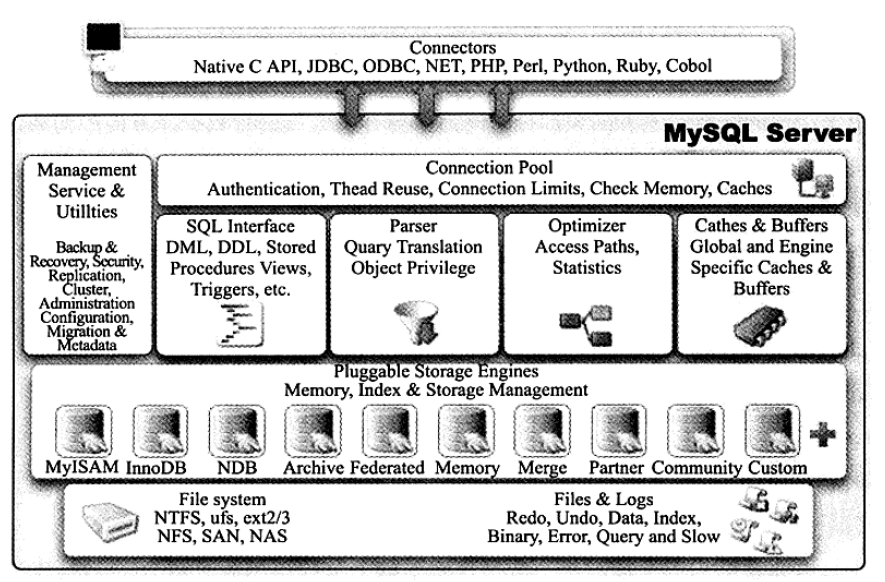
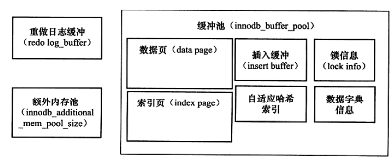

# MySQL 介绍

### 1. 体系结构

从上图可知，MySQL由以下几部分组成：

* 连接池组件
* 管理服务和工具组件
* sql接口组件
* 查询分析组件
* 缓冲组件
* 插件式引擎
* 物理文件

MySQL区别于其他数据库最重要的一个特点就是其插件式的表存储引擎。

### 2. 存储引擎

​ 每个存储引擎都有各自的特点，能够根据具体的应用建立不同存储引擎表。由于MySQL的开源特性，用户可以根据MySQL预定义的存储引擎接口编写自己的存储引擎。以下是对存储引擎的一些简单介绍。

#### 2.1 InnoDB

​ InnoDB存储引擎**支持事务**，设计目标主要面向在线事务处理（OLTP）的应用。其特点是**行锁设计、支持外键**。从MySQL5.5.8版本开始，InnoDB是默认的存储引擎。

​ InnoDB通过多版本并发控制（MVCC）来获取高并发性，实现了SQL标准的4种隔离级别，默认REPEATABLE级别，同时使用一种next-key-locking的策略来避免幻读（phantom）现象的产生。除此之外Innodb还提供了**插入缓冲，二次写，自适应哈希，预读**等高性能高可用的功能。

​ 对于表中数据的存储，InnoDB存储引擎采用了聚集索引的方式，因此每张表的存储是按主键的顺序存放。如果没有显示的在表定义时定义主键，InnoDB存储引擎会为**每一行生成一个6字节的ROWID**，并以此作为主键。

**2.1.1 体系结构**

InnoDB存储引擎有多个内存块，组成了一个大的内存池。各种后台进程/线程与其交互。内存池又和磁盘文件交互。

内存池负责以下工作：

* 维护所有进程/线程需要访问的多个内部数据结构
* 缓存磁盘上的数据，方便快速读取
* 重做日志redo log缓冲
* 基于磁盘存储，并将其中的记录按页的方式进行管理

**2.1.1.1 后台线程**

主要作用是：

* 刷新内存池的数据，保证缓冲池中的内存缓存的是最近的数据。
* 将已修改的文件刷新到磁盘文件。
* 保证数据库在发生异常的情况下innodb能恢复到正常状态。

1.  Master Thread

    主要负责将缓冲池中的数据异步刷新到磁盘，保证数据的一致性，包括脏页的刷新，合并插入缓存，UNDO页的回收等。
2.  IO Thread

    在InnoDB存储中大量使用了AIO 来异步处理IO请求。
3.  Purge Thread

    回收事务提交后的undolog分配的undo页

**2.1.1.2 内存**

**1. 缓冲池**

作用：弥补CPU速度与磁盘速度之间的鸿沟 读取页时：从磁盘读到的页存放到缓冲池中，这个过程称为将页fix到缓冲池中。下一次再读相同的页时该页在缓冲池中直接命中，否则读取磁盘中的页

修改操作：首先修改缓冲池中的页，然后以一定频率（checkpoint机制）刷新到磁盘

缓冲池缓存的数据页的大小默认为16kb，数据页类型有：

* 索引页
* 数据页
*   undo页

    逻辑日志，保存日志一致性
* 插入缓冲页
* 自适应哈希索引
* 锁信息
* 数据字典信息&#x20;

从InnoDB1.0.X版本开始，允许有多个缓冲池实例。每个页根据哈希值平均分配到不同缓冲池实例中。

配置：innodb\_buffer\_pool\_size 缓冲池大小 innodb\_buffer\_pool\_instances 缓冲池实例个数

**2. LRUList、FreeList、FlushList**

(1) LRUList（最近最少使用算法）

与传统LRU算法不同，innodb对传统的LRU算法做了一些优化。添加了midpoint的概念。 新读取的页并不会直接放到LRU列表的首部，而是放到LRU列表的midpoint位置，默认为列表的5/8处。可由参数innodb\_old\_blocks\_pct控制。 midpoint之前为new列表，之后为old列表。 innodb\_old\_blocks\_time 等待多久才会j加入热端

(2) FreeList

数据库刚启动时,LRU列表是空的，这时页都存放到Free页中。当需要从缓冲池分页时，首先从Free页中查找是否有可用的空闲页，若有则在Free列表中删除，放到LRU列表

(3) flushList

管理将页刷新到磁盘

(4) 重做日志缓存

Innodb存储引擎首先将重做日志信息先放入这个缓冲区，然后按一定频率刷新到重做日志文件。 配置参数：innodb\_log\_buffer\_size: 8mb

有3种情况会从日志缓冲区刷新到外部磁盘的重做日志文件： MasterThread每一秒会执行该操作 每个事物提交时会执行该操作 当重做日志缓冲区剩余情况小于1/2时

(5) 额外内存池

在innodb存储引擎中，对内存的管理是通过一种称为内存堆的方式进行的。在对一些本身的数据结构的内存进行分配时，需要从额外的内存池申请，当该区域的内存不够时，会从缓冲池申请

**2.1.2 checkpoint技术**

避免数据丢失，普遍采用了Write Ahead Log策略。 当数据库发生宕机时，只恢复checkpoint之后的日志就行。

当缓冲池不够用时，根据LRU算法会溢出最近最少使用的页，若此页为脏页，那么需要强制执行checkpoint

不同之处在于每次从哪里取脏页，以及什么时间触发checkpoint。

两种模式：

*   sharp checkpoint

    发生在数据库关闭时将所有脏页都刷新到磁盘。 默认工作方式：innodb\_fast\_shutdown=1
*   Fuzzy checkpoint

    运行时使用，只刷新一部分脏页

    几种情况： MasterThread FLUSH\_LRU\_LIST Drity Page too much

    innodb\_max\_dirty\_pages\_pct: 75 当脏页占对应百分比之后进行刷新

**2.1.3 关键特性**

*   插入缓冲

    产生原因：非聚集索引的插入不是顺序的，这时需要离散的访问非聚集索引页，随机读取会导致性能下降。 解决原理：设计了insert buffer，对非聚集索引的插入或更新不是每一次直接插入到索引页中，而是先判断是否在缓冲池中，若存在，则直接插入，否则先放到insert buffer中，之后按 一定频率进行合并。 使用需要满足以下两种条件：索引是辅助索引，索引不是唯一的。 在写密集的情况下，插入缓冲池会占用过多的缓冲池内存，默认最大可以占用到1/2的缓冲池内存。

    B+树实现
*   两次写

    产生问题：当数据库宕机时，innodb存储引擎正在将数据页写到表中，这时写了一部分，叫做部分写失效，虽然有重做日志记录，但是页有可能损坏。 由两部分组成：内存中的doublewrite buffer 2MB 磁盘上的共享空间的128页，即2个区，2MB 解决原理：在缓冲池的脏页刷新时，并不直接写磁盘，而是先复制到内存的doublewrite buffer，再通过该缓冲区，写到共享空间的磁盘，之后同步磁盘 提升数据页的可靠性
*   自适应哈希

    Innodb存储引擎会自动根据访问频率和模式来自动的为某些热点数据页建立哈希索引。 要求：必须是等值查询 ='' ,范围查询哈希索引不会生效 以此查询连续执行 页通过该模式查询了N=页记录数/16

    SHOW ENGINE INNODB STATUS查看状态
*   异步IO

    数据库系统都使用异步io去处理磁盘操作 AIO
*   刷新邻接页

    工作原理：当刷新一个脏页，innodb会检测该页所在区的所有页，如果是脏页，那么一起刷新。 好处是可以将多个IO合并。

#### 2.2 MyISAM

MyISAM存储引擎不支持事务、表锁设计，支持全文索引。它的缓冲池只缓存索引文件，不缓冲数据文件。

#### 2.3 NDB

#### 2.4 Memory
