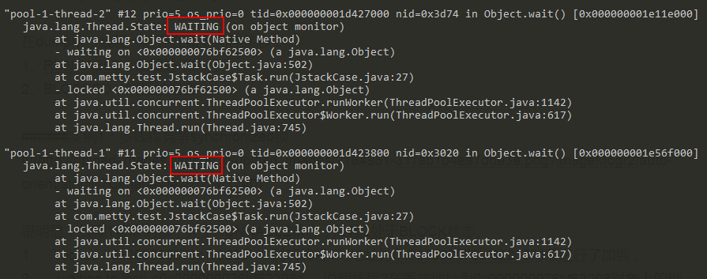
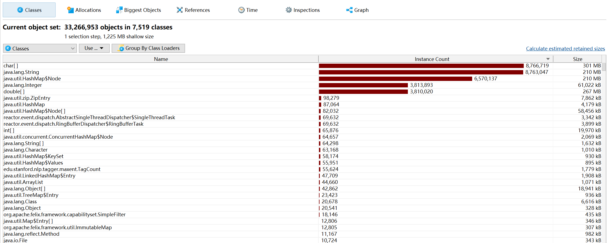
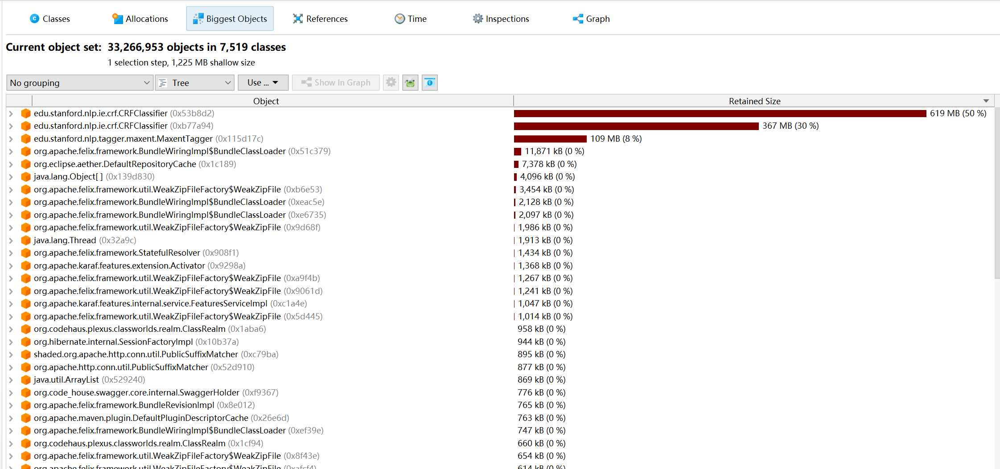
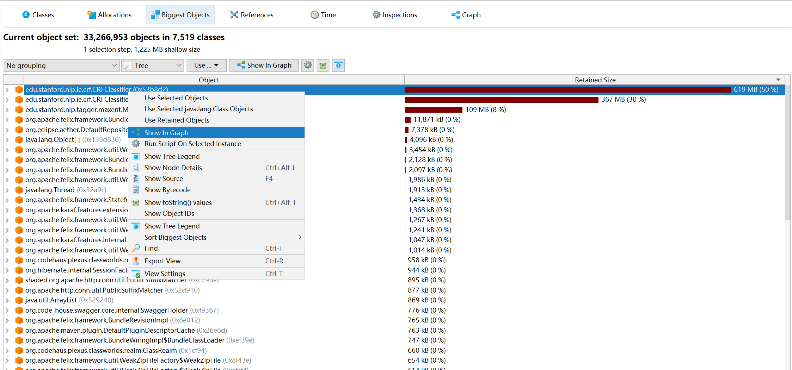
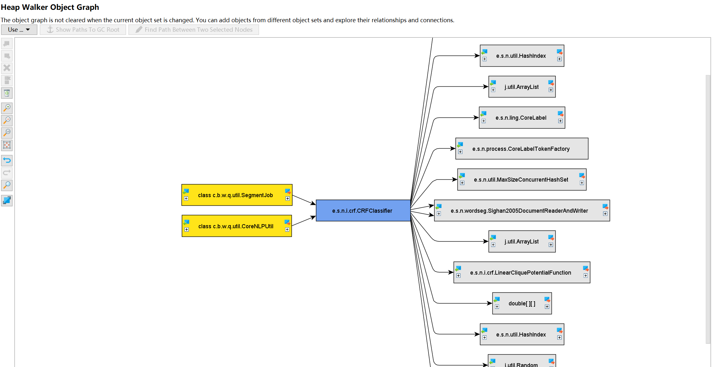
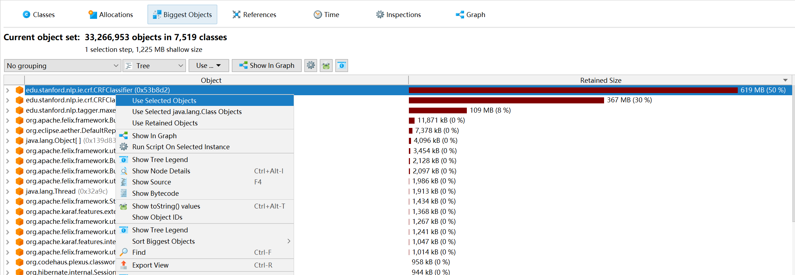
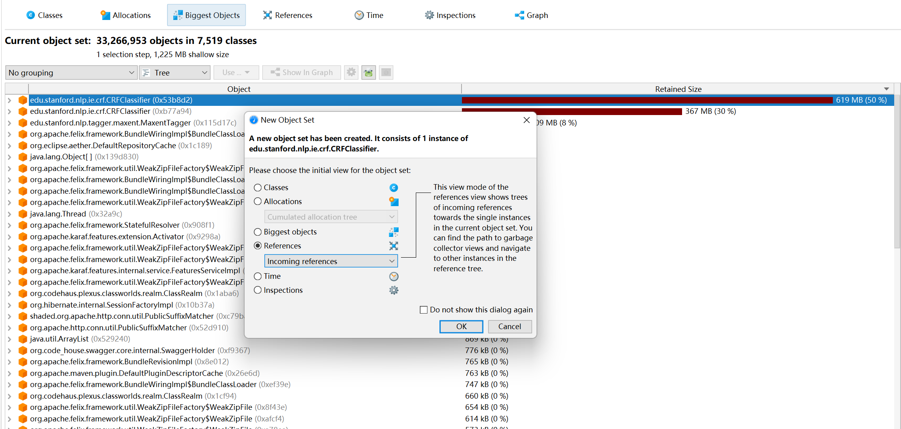
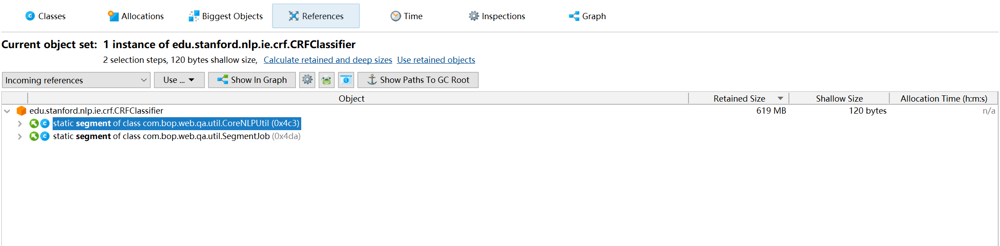

# JProfiler

## 记一次线上服务分析

### CPU使用率分析

测试环境的服务器CPU使用率居高不下，自然是有某些线程一直占用着CPU资源，那么以下分享排查占用CPU较高线程的一些手段

```
1.top 在linux环境下，可以通过top命令查看各个进程的cpu使用情况，默认按cpu使用率排序
2. top -Hp PID 查看此进程中各线程的占用率
3. jstack -l pid > tmp.txt 备份出该线程当前的堆栈状态
```

在top命令中，已经获取到了占用cpu资源较高的线程pid，<mark style="color:red;">将该pid转成16进制的值</mark>，在thread dump中每个线程都有一个nid，找到对应的nid即可；隔段时间再执行一次stack命令获取thread dump，区分两份dump是否有差别，在nid对应的线程调用栈中，发现该线程一直在执行JstackDemo类的calculate方法，得到这个信息，就可以检查对应的代码是否有问题。

**Thread dump线程状态**

除了上述的分析，大多数情况下会基于thead dump分析当前各个线程的运行情况，如是否存在死锁、是否存在一个线程长时间持有锁不放等等。

在dump中，线程一般存在如下几种状态：&#x20;

1、RUNNABLE，线程处于执行中&#x20;

2、BLOCKED，线程被阻塞&#x20;

3、WAITING，线程正在等待


1、`locked <0x000000076bf62208>`说明线程1对地址为0x000000076bf62208对象进行了加锁；&#x20;

2、`waiting to lock <0x000000076bf62208>` 说明线程2在等待地址为0x000000076bf62208对象上的锁；

&#x20;3、`waiting for monitor entry [0x000000001e21f000]`说明线程1是通过synchronized关键字进入了监视器的临界区，并处于"Entry Set"队列，等待monitor；

通过wait挂起线程

```
static class Task implements Runnable {    
@Override    
public void run() {        
    synchronized (lock) {            
        try {                
            lock.wait();                        
        } catch (InterruptedException e) {                
                e.printStackTrace();            
        }        
    }    
}
}
```

dump结果



线程1和2都处于WAITING状态&#x20;

1、线程1和2都是先`locked <0x000000076bf62500>`，再`waiting on <0x000000076bf62500>`，之所以先锁再等同一个对象，是因为wait方法需要先通过synchronized获得该地址对象的monitor；&#x20;

2、`waiting on <0x000000076bf62500>`说明线程执行了wait方法之后，释放了monitor，进入到"Wait Set"队列，等待其它线程执行地址为0x000000076bf62500对象的notify方法，并唤醒自己，具体实现可以深入分析Object.wait/notify实现机制；

### 内存溢出分析

```
引起内存溢出的原因有很多种，常见的有以下几种：　　
1.内存中加载的数据量过于庞大，如一次从数据库取出过多数据；　　
2.集合类中有对对象的引用，使用完后未清空，使得JVM不能回收；　　
3.代码中存在死循环或循环产生过多重复的对象实体；　　
4.使用的第三方软件中的BUG；　　
5.启动参数内存值设定的过小；
```

**暴力解决办法：**

```
根据日志信息进行配置修改：
【情况一】java.lang.OutOfMemoryError:Javaheapspace：这种是java堆内存不够，一个原因是真不够应用启动的基本配置，另一个原因是程序中有死循环；　　
    如果是java堆内存不够的话，可以通过调整JVM下面的配置来解决：　　
    -Xms4096m　　-Xmx4096m
【情况二】　　java.lang.OutOfMemoryError:GCoverheadlimitexceeded　　
【解释】：JDK6新增错误类型，当GC为释放很小空间占用大量时间时抛出；一般是因为堆太小，导致异常的原因，没有足够的内存。　　
【解决方案】：　　
1、查看系统是否有使用大内存的代码或死循环；　　
2、通过添加JVM配置，来限制使用内存：　　
    -XX:-UseGCOverheadLimit
【情况三】：　　
    java.lang.OutOfMemoryError:PermGenspace：这种是P区内存不够，可通过调整JVM的配置：　　
    -XX:MaxPermSize=128m　　-XXermSize=128m　　
【注】：　　
    JVM的Perm区主要用于存放Class和Meta信息的,Class在被Loader时就会被放到PermGenspace，这个区域成为年老代，GC在主程序运行期间不会对年老区进行清理，　　默认是64M大小，当程序需要加载的对象比较多时，超过64M就会报这部分内存溢出了，需要加大内存分配，一般128m足够。
【情况四】：　　
    java.lang.OutOfMemoryError:Directbuffermemory　　
    调整堆外内存-XX:MaxDirectMemorySize=参数，如添加JVM配置：　　
    -XX:MaxDirectMemorySize=128m
【情况五】：　　java.lang.OutOfMemoryError:unabletocreatenewnativethread　　
    【原因】：Stack空间不足以创建额外的线程，要么是创建的线程过多，要么是Stack空间确实小了。　　
    【解决】：由于JVM没有提供参数设置总的stack空间大小，但可以设置单个线程栈的大小；而系统的用户空间一共是3G，　　　　　　　
              除了Text/Data/BSS/MemoryMapping几个段之外，Heap和Stack空间的总量有限，是此消彼长的。因此遇到这个错误，　　　　　　  可以通过两个途径解决：1.通过-Xss启动参数减少单个线程栈大小，这样便能开更多线程（当然不能太小，太小会出现                                        StackOverflowError）；　　　　　　　　　　　　　　　　　　2.通过-Xms-Xmx两参数减少Heap大小，将内存让给Stack（前提是保证Heap空间够用）。
【情况六】：　　
    java.lang.StackOverflowError　　
    【原因】：这也内存溢出错误的一种，即线程栈的溢出，要么是方法调用层次过多（比如存在无限递归调用），要么是线程栈太小。　　
    【解决】：优化程序设计，减少方法调用层次；调整-Xss参数增加线程栈大小                  
```

**排查溢出原因：**

1. 首先dump下堆内存快照

```
jmap -dump:live,format=b,file=heap.hprof ${PID}
```

1. 使用JProfiler打开dump文件（version：JProfiler11）：

```
在JProfiler的堆遍历器(Heap Walker)中，你可以对堆的状况进行快照并且可以通过选择步骤下寻找感兴趣的对象。堆遍历器有五个视图：​
类 Classes
显示所有类和它们的实例，可以右击具体的类"Used Selected Instance"实现进一步跟踪
​分配 Allocations
为所有记录对象显示分配树和分配热点
​大对象 Biggest Objects
为每个对象占用内存的排序列表
​索引 References
为单个对象和“显示到垃圾回收根目录的路径”提供索引图的显示功能。还能提供合并输入视图和输出视图的功能。​时间 Time显示一个对已记录对象的解决时间的柱状图。
​检查 Inspections
显示了一个数量的操作，将分析当前对象集在某种条件下的子集，实质是一个筛选的过程。
```



1. 查看Biggest objects



发现其中edu.stanford.nlp.ie.crf.CRFClassifier占用内存最多

1. Show in graph



观察引用关系，可以发现此类中SegmentJob与CoreNLPUtil类中被引用



5.打开此对象的被引用关系索引树 （incoming ）





其中发现CRFClassifier实例化的对象segment被CoreNLPUtil和SegmentJob类引用，且占用内存最多



观察本地项目代码得知：

```
public class SegmentJob { 
  ...  
  ...     
  //segment在CoreNLPUtil执行初始化      
  private static CRFClassifier<CoreLabel> segment;      
  private CRFClassifier<CoreLabel> getSegment() {        
    if(segment == null) {            
      synchronized (SegmentJob.class) {                
        if(segment == null) {                    
          segment = CoreNLPUtil.getSegmentProps();                
        }            
      }        
    }       
         return segment;   
  }
}

​public class CoreNLPUtil {​    
  //加载词典文件    
  public static CRFClassifier<CoreLabel> getSegmentProps(){        
  Properties props = new Properties();       
   //数据文件路径        
   props.setProperty("sighanCorporaDict", path+"/nlp/data");        
   //词典文件路径，dict-custom.txt 为用户自定义词典        
   props.setProperty("serDictionary", path+"/nlp/data/dict-chris6.ser.gz,"+path+"/nlp/data/dict-custom.txt");        
   props.setProperty("inputEncoding", "UTF-8");        
   props.setProperty("sighanPostProcessing", "true");        
   segment = new CRFClassifier<CoreLabel>(props);        
   //宾州大学的中国树库训练语料        
   segment.loadClassifierNoExceptions(path+"/nlp/data/ctb.gz", props);        
   segment.flags.setProperties(props);​        
   return segment;   
    }
}
```

根据分析可以判断出，因为词典文件属于基本词库，所以此种属于情况一，不够应用所启动的基本配置，调大堆内存即可。
